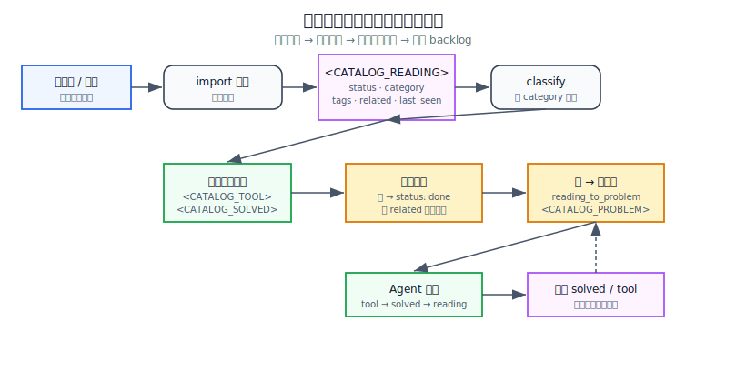
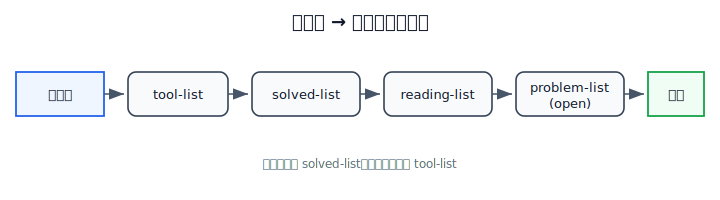
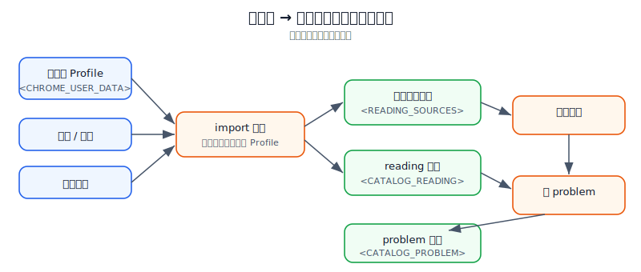
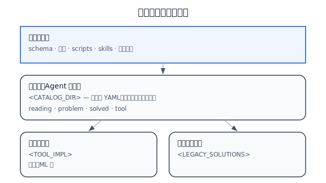
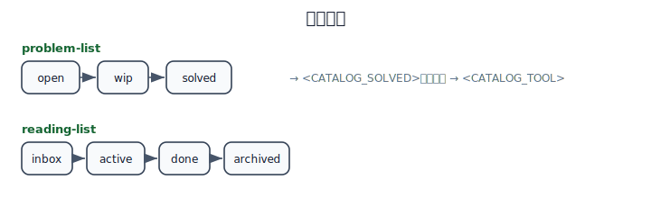

# Quanta Learn — 设计说明

> Design v1.2 · 以 **reading-list 消化** 为主线  
> 流程图均为 **SVG**（`docs/images/`），占位符不含本机路径。

---

## 1. 要解决什么

学习材料常堆在浏览器书签与历史里，**读不完、记不住、和已做过的题/工具对不上号**。本项目的首要目标不是「再建一个笔记库」，而是：

1. **自动取材** — 把阅读源合并进带指标的 reading 索引；
2. **指标驱动消化** — 用 status、category、tags、related 管理 backlog；
3. **复用已有解法** — 用 tool-list、solved-list 里的条目先解题，减少重复阅读；
4. **闭环** — 仍不会的进 problem-list，解决后回写 solved / tool，提高下次命中率。



---

## 2. 四清单各自角色

| 清单 | 在消化链路中的角色 | 占位符 |
|------|-------------------|--------|
| **reading-list** | **主队列**：待消化材料、进度、与题/工具的交叉引用 | `<CATALOG_READING>` |
| **tool-list** | 可复用工具；消化时**优先匹配**（tags、name、entry） | `<CATALOG_TOOL>` |
| **solved-list** | 历史题解；消化时**次优先匹配**（topics、summary） | `<CATALOG_SOLVED>` |
| **problem-list** | reading 无法仅靠复用解决时的**动手待办** | `<CATALOG_PROBLEM>` |

**两条链路（不要混为一谈）**

| 链路 | 顺序 | 何时用 |
|------|------|--------|
| **消化 reading** | 取材 → 分类指标 → 匹配 tool/solved → done 或转 problem | 处理阅读 backlog |
| **解答新问题** | tool → solved → reading（补概念）→ problem | 用户/Agent 抛出一个具体问题 |



---

## 3. reading-list 指标（消化用）

Agent 与脚本依赖下列字段推进 backlog（完整定义见 [schema.md](catalog/schema.md)）：

| 字段 / 概念 | 消化用途 |
|-------------|----------|
| `status` | `inbox` 待处理 → `active` 进行中 → `done` 已消化 → `archived` 归档 |
| `category` | `classify_reading_items.py` 根据 URL/标题规则写入，决定能否 `reading_to_problem` |
| `tags` | 与 tool/solved 的 tags、topics 对齐，用于匹配 |
| `source` | `chrome-bookmark` / `chrome-history` / `chrome-session` / `manual` |
| `last_seen` | 历史重复访问可抬高优先级 |
| `related.tools` / `related.solved` / `related.problems` | 命中后写入，避免下次从零检索 |

**匹配策略（Agent）**

1. 对 `status: inbox | active` 的 reading 项，用 **tags + category + title** 检索 tool-list、solved-list。
2. 若命中且足以回答材料中的问题 → 更新 `related`，`status: done`，摘要写入 `summary`（可选）。
3. 若 category ∈ {algorithm, debug, system-design} 且需动手 → `reading_to_problem.py` 生成 problem，`related.problems` 回链。
4. 问题解决后 → solved-list 新增或更新，可泛化则 tool-list 登记，并回写 reading 的 `related`。

---

## 4. 自动取材与流水线

只读读取浏览器 Profile（书签 JSON、History SQLite 副本、Session 文件），**不写回浏览器**。



| 步骤 | 脚本 | 产出 |
|------|------|------|
| 1 取材 | `import_chrome_sources.py` | 合并 `<CATALOG_READING>` + 快照 `<READING_SOURCES>` |
| 2 打指标 | `classify_reading_items.py` | 更新 `category`、必要时 `tags` |
| 3 转待办 | `reading_to_problem.py` | 可动手项 → `<CATALOG_PROBLEM>`（`reading-derived`） |
| 4 补索引 | `sync_catalog_from_legacy.py` | 从 `<LEGACY_SOLUTIONS>` / `<TOOL_IMPL>` 扫描，充实 tool、solved |

```bash
export CHROME_USER_DATA_DIR="<your-browser-profile-dir>"
python3 scripts/import_chrome_sources.py
python3 scripts/classify_reading_items.py
python3 scripts/reading_to_problem.py
python3 scripts/sync_catalog_from_legacy.py
```

---

## 5. 概念分层与公开边界



| 层 | 开源仓库 | 仅本地 |
|----|----------|--------|
| 框架 | schema、模板、scripts、skills | — |
| 索引 | 字段说明 | `<CATALOG_DIR>/*.yaml` |
| 内容 | 工具与题解代码骨架 | 阅读快照、自动生成的 problem 正文 |

`bash scripts/init_local_catalog.sh` 从 `*.yaml.example` 生成本地四清单。

---

## 6. problem 类型与状态

| kind | 说明 |
|------|------|
| `reading-derived` | 由阅读项转化，**消化链路的主出口** |
| `algorithm` / `debug` / `system-design` | 与 reading 的 `category` 对齐 |



---

## 7. 代码归档（提高匹配率）

| 占位符 | 内容 |
|--------|------|
| `<TOOL_IMPL>` | 可复用实现（算法库、ML 等） |
| `<LEGACY_SOLUTIONS>` | 历史题解归档 |

`sync_catalog_from_legacy.py` 把代码路径写入 tool/solved 索引，使消化 reading 时更容易命中已有实现。

---

## 8. Agent 协议

详见 [AGENTS.md](AGENTS.md)：默认任务视为 **消化 reading backlog**；独立新问题再走 tool → solved → reading → problem。

---

## 9. 展示层（待实现）

索引层已有状态字段，但**缺少汇总与队列 UI**。展示层设计（指标口径、Kanban、分阶段落地）见 **[docs/UI-DESIGN.md](docs/UI-DESIGN.md)**。

---

## 10. 路线图

开发待办明细见 [docs/TODO.md](docs/TODO.md)。

- [x] Phase 1：自动取材 + reading 指标 + problem 转化 + 开源框架
- [ ] **飞书任务清单抓取**（Task v2：`my_tasks` / 可选按清单；`task:task:read` + `user_access_token`）
- [ ] **Dashboard 展示层**（统计卡 + 阅读/问题队列，见 UI-DESIGN）
- [ ] Phase 2：匹配评分（tags/topics 相似度）、批量消化命令
- [ ] Phase 3：MCP 暴露「取下一篇 inbox」「写 related」等工具

---

## 11. 图示规范

- 路径：`docs/images/*.svg`，须含 `xmlns="http://www.w3.org/2000/svg"`
- 图中仅用占位符（如 `<CATALOG_READING>`），不写盘符与本机目录
