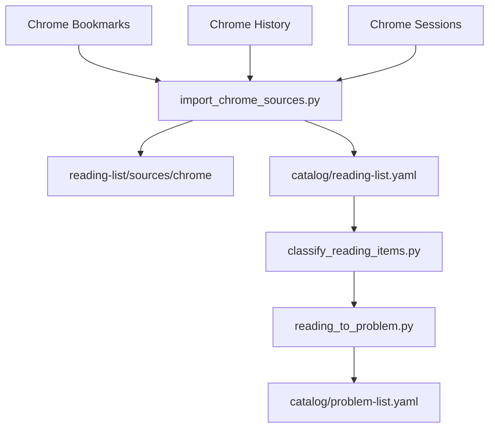

# Auto Learn — 个人学习 Agent 项目设计

> 状态：Design v1.0（已确认实施）  
> 项目名：`auto-learn`  
> 前身：`exam` 算法题解仓库（已改名为 `auto-learn` / 物理目录 `auto_learn`）

---

## 1. 目标

将分散的题解、阅读标签、Chrome 书签/历史/会话缓存，统一索引为 Agent 可检索的四清单系统：

| 模块 | 职责 |
|------|------|
| **tool-list** | 可复用求解工具（第一优先检索） |
| **solved-list** | 历史题解与实现（第二优先匹配） |
| **reading-list** | Chrome 与文档阅读记忆 |
| **problem-list** | 待解决问题（算法 / debug / 系统设计） |

## 2. 核心工作流

```
新问题
  → tool-list
  → solved-list
  → reading-list（补概念）
  → problem-list（status: open）
  → 解决后 → solved-list，可泛化则 tool-list
```

## 3. Chrome 自动索引流程



### 数据源（只读）

默认 Profile：

`/mnt/c/Users/ordinar/AppData/Local/Google/Chrome/User Data/Default`

| 文件 | 用途 |
|------|------|
| `Bookmarks` | 书签树（JSON） |
| `History` | 最近访问 URL（SQLite 只读副本） |
| `Sessions/Session_*` | 会话缓存 URL 提取 |

**约束**：脚本只复制/读取，不写回 Chrome Profile。

### 维护命令

```bash
python3 scripts/import_chrome_sources.py
python3 scripts/classify_reading_items.py
python3 scripts/reading_to_problem.py
python3 scripts/sync_catalog_from_legacy.py
```

## 4. 目录结构

```text
auto-learn/
├── AGENTS.md
├── DESIGN.md
├── README.md
├── catalog/
│   ├── schema.md
│   ├── reading-list.yaml
│   ├── problem-list.yaml
│   ├── solved-list.yaml
│   └── tool-list.yaml
├── reading-list/
│   ├── inbox/
│   ├── active/
│   ├── archive/
│   └── sources/chrome/
├── problem-list/
│   ├── algorithm/
│   ├── debug/
│   ├── system-design/
│   └── generated-from-reading/
├── solved-list/notes/
├── tool-list/
│   ├── registry.yaml
│   ├── ml/
│   ├── algorithms/
│   └── runners/
├── scripts/
└── legacy/                 # 可选：后续归档现有 Coding/ 等
```

Phase 1：**索引优先**，现有 `Coding/` 等目录通过 `catalog/solved-list.yaml` 引用，不强制搬迁。

## 5. problem-list 类型

| kind | 说明 | 目录 |
|------|------|------|
| `algorithm` | 算法题、刷题、数据结构 | `problem-list/algorithm/` |
| `debug` | Bug、报错、调试 | `problem-list/debug/` |
| `system-design` | 系统设计、架构 | `problem-list/system-design/` |
| `reading-derived` | 从 Chrome 阅读自动转化 | `problem-list/generated-from-reading/` |

## 6. Agent 协议

详见 [AGENTS.md](AGENTS.md)。

检索顺序：**tool-list → solved-list → reading-list → problem-list**。

## 7. 迁移阶段

- [x] Phase 0：设计确认
- [x] Phase 1：索引层 + Chrome 导入 + 项目改名 auto-learn
- [ ] Phase 2：legacy 物理归档、统一 runner
- [ ] Phase 3：MCP 工具封装

## 8. 总结

> **Tool 优先、Solved 次之、Reading 补概念、Problem 兜底线**；Chrome 书签/历史/会话自动进入 reading-list，再按规则转为 problem-list。
