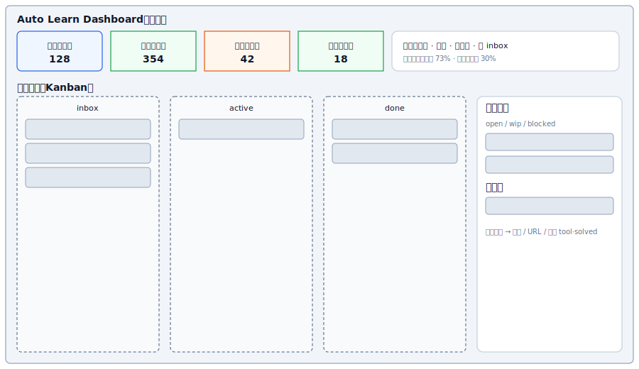

# Quanta Learn — 展示层设计（Dashboard / 队列）

> 状态：Design v0.2（**已确认**，可进入实现）  
> 目标：在**不暴露本机路径**的前提下，把四清单进度「看得见」——多少已解决、多少未解决、队列里分别是什么、按什么分类筛选。

当前仓库**只有 YAML 索引 + 脚本**，没有统计汇总与前端；本文定义展示层应展示什么、数据从哪来、页面怎么分、分阶段怎么落地。

相关：[DESIGN.md](../DESIGN.md)（业务与消化闭环）、[catalog/schema.md](../catalog/schema.md)（字段）、[docs/TODO.md](TODO.md)（实现待办）。

---

## 1. 你的理解对不对？

**对。** 索引层（catalog）已经能记「待办 / 进行中 / 已完成」，但缺少：

| 缺口 | 影响 |
|------|------|
| **汇总指标** | 不知道 backlog 有多大、消化了多少 |
| **队列视图** | 看不清「下一件该处理什么」 |
| **分类维度** | 算法 / debug / 阅读来源等无法一眼过滤 |
| **友好展示** | 只能翻 YAML，不适合日常扫一眼 |

展示层以**本地读 catalog** 为主；**v1 支持拖拽改状态**（写回 `<CATALOG_DIR>/*.yaml`，仍不提交 Git、不上传云端）。

---

## 2. 设计原则

1. **以 reading 消化为主队列，problem 为动手队列** — 与产品主线一致。  
2. **指标可计算、可复现** — 由脚本从 YAML 聚合，避免手改数字。  
3. **状态一眼可辨** — 颜色 + 列（Kanban）+ 顶栏数字卡片。  
4. **分类多维但不乱** — 主筛：队列状态；次筛：category / kind / source。  
5. **本地优先** — 默认 `127.0.0.1` 或静态 HTML；catalog 仍 gitignore。  
6. **占位符配置** — 页面不出现真实盘符；仓库路径通过环境变量 `<REPO_ROOT>` / `<CATALOG_DIR>` 注入运行时。

---

## 3. 指标定义（顶部统计卡）

所有数字由 **`scripts/build_dashboard_stats.py`**（待实现）从四清单计算，输出 `dashboard/stats.json`（gitignore）供前端读取。

### 3.1 阅读（reading-list）

| 指标 ID | 含义 | 计算规则 |
|---------|------|----------|
| `reading_pending` | 待消化 | `status ∈ {inbox, active}` |
| `reading_done` | 已消化 | `status ∈ {done, archived}` |
| `reading_total` | 总条数 | 全部 reading 条目 |
| `reading_digest_rate` | 消化率 | `reading_done / reading_total`（total=0 时为 0） |
| `reading_matched` | 已关联解法 | `related.tools` 或 `related.solved` 非空 |
| `reading_match_rate` | 复用命中率 | `reading_matched / reading_done`（done=0 时为 0） |

### 3.2 问题（problem-list）

| 指标 ID | 含义 | 计算规则 |
|---------|------|----------|
| `problem_open` | 未解决 | `status ∈ {open, wip, blocked, deferred}` |
| `problem_solved` | 已解决（索引内） | `status = solved` |
| `problem_total` | 总条数 | 全部 problem 条目 |
| `problem_resolve_rate` | 解决率 | `problem_solved / problem_total` |

> **注意**：`problem.status=solved` 与 **solved-list** 是两层：前者是待办关闭，后者是题解归档。Dashboard 上**分开展示**，并在条目详情里显示 `related.solved` 是否已回链。

### 3.3 题解与工具（辅助）

| 指标 ID | 含义 | 计算规则 |
|---------|------|----------|
| `solved_count` | 题解库规模 | solved-list 条数 |
| `tool_count` | 可复用工具数 | tool-list 条数 |

### 3.4 顶栏示例（示意）



---

## 4. 队列与分类

### 4.1 阅读队列（主 Kanban）

| 列 | 对应 `status` | 排序建议 |
|----|---------------|----------|
| 待处理 | `inbox` | `last_seen` 降序（最近又打开的优先） |
| 进行中 | `active` | `updated_at` 降序 |
| 已消化 | `done` | `updated_at` 降序 |
| 归档 | `archived` | **默认折叠**（见 §10）；展开后为第四列或折叠面板 |

**卡片展示字段（最小集）**

- 标题 `title`
- 分类徽章 `category`（algorithm / debug / system-design / reading / unknown）
- 来源徽章 `source`（chrome-bookmark / history / session / manual）
- 若有 URL：外链图标（不展示完整路径，hover 显示域名）
- 角标：是否已 `related.tools` / `related.solved`

### 4.2 问题队列（侧栏或第二 Tab）

| 分组 | 对应 `status` | 说明 |
|------|---------------|------|
| 未解决 | `open`, `wip`, `blocked`, `deferred` | 默认展开；`wip` 高亮 |
| 已解决 | `solved` | 列表 + 跳转 `related` / 本地笔记 `path` |

**次维度（筛选器，不拆列）**

| 维度 | 字段 | UI |
|------|------|-----|
| 类型 | `kind` | 多选 chip：algorithm / debug / system-design / reading-derived |
| 来源 | `source` | chrome / manual …（**v1 不含** `feishu-task`，见 §10） |
| 优先级 | `priority` | high / medium / low |

### 4.3 题解 Tab（solved-list，v1 必选）

| 列 / 字段 | UI |
|-----------|-----|
| `title` | 主标题 |
| `topics` | tag 列表 |
| `language` | 徽章 |
| `quality` | draft / runnable / reviewed 色点 |
| `paths` | 点击用本地 API 打开或复制相对 path（不展示绝对盘符） |
| `related.reading` | 链回阅读条目 |

排序：`updated_at` 或 `title` 字母；支持按 `topics` / `source` 筛选。

### 4.4 「解决了哪些 / 没解决哪些」统一口径

对用户只说两类主视图，避免四清单混淆：

| 用户问题 | 看哪块 UI |
|----------|-----------|
| 阅读材料消化得怎样？ | **阅读 Kanban** + `reading_*` 指标 |
| 动手题/待办解决得怎样？ | **问题队列** + `problem_*` 指标 |
| 库里已有多少题解？ | 顶栏 **`solved_count`**（必选）+ **「题解」Tab**（必选） |

**交叉关系**：阅读卡片点进详情 → 展示关联的 `related.problems`；问题卡片 → 展示 `related.reading`、`related.tools`、`solved_similar`。

---

## 5. 信息架构（页面）

```
Dashboard（本地 Web，默认打开即阅读看板）
├── 顶栏：指标卡片（含 reading_*、problem_*、solved_count、tool_count）+ 筛选 + 刷新时间
├── Tab A：阅读看板（Kanban，**默认 Tab**）
│     ├── 列：inbox | active | done
│     └── 归档区：archived **默认折叠**，显示条数，点击展开
├── Tab B：问题队列（未解决 / 已解决）
├── Tab C：题解列表（solved-list，**v1 必选**）
└── 抽屉：条目详情（related、摘要、URL / 笔记 path）
```

**v1 必须支持**

- 阅读卡片 / 问题卡片 **拖拽** 改 `status`（跨列即改状态），写回 YAML 后刷新队列与顶栏数字。
- 顶栏展示 **`solved_count`**（及 `tool_count`）。

**v1 不做**

- 飞书 `source=feishu-task` 筛选（飞书导入见 [TODO.md](TODO.md)，整体后置）。
- 飞书回写、账号登录、在线编辑 YAML 全文。

---

## 6. 数据流（实现时）

```text
<CATALOG_DIR>/*.yaml
        │
        ▼
build_dashboard_stats.py  ──►  dashboard/stats.json
        │                      dashboard/queues.json   （列分组后的条目摘要）
        ▼
本地 HTTP（FastAPI / Flask，v1 起，供拖拽写回）
        │
        ▼
浏览器 127.0.0.1:<port>   （默认 Tab = 阅读看板）
```

**`queues.json` 条目摘要**（不含敏感长文本，可进内存）示例：

```json
{
  "id": "read-xxx",
  "title": "...",
  "status": "inbox",
  "category": "algorithm",
  "source": "chrome-bookmark",
  "domain": "leetcode.com",
  "has_tool_match": true,
  "has_solved_match": false,
  "updated_at": "2026-05-24"
}
```

完整 `url` 仅在详情请求或用户点击时由本地 API 返回（避免静态页泄露书签全集到错误目录）。

---

## 7. 技术方案（分阶段）

| 阶段 | 交付 | 说明 |
|------|------|------|
| **P0** | `build_dashboard_stats.py` + 终端表格 | 验证指标口径；输出 `dashboard/stats.json` |
| **P1（v1）** | `dashboard/server.py` + 前端单页 | **默认阅读看板**；三 Tab（阅读 / 问题 / 题解）；顶栏含 `solved_count`；**拖拽改 status**；归档列默认折叠 |
| **P2** | 体验增强 | 全局搜索、筛选持久化、导出 CSV、透视表（可选） |
| **后置** | 飞书任务进队列后的 `feishu-task` 筛选 | 与飞书导入同期，见 TODO |

**拖拽写回 API（v1）**

| 方法 | 路径 | 行为 |
|------|------|------|
| `PATCH` | `/api/reading/:id/status` | 更新 reading `status`，重算 stats |
| `PATCH` | `/api/problem/:id/status` | 更新 problem `status`，重算 stats |

实现时复用 `_catalog_utils` 读写 YAML；禁止改 catalog 以外字段（v1 仅 status）。

**推荐栈（P1–P2）**

- 生成：Python（与现有 `_catalog_utils` 共用）
- 前端：静态 HTML + 少量原生 JS，或 **Vue/React 单文件**（若你希望组件化）
- 样式：与现有 `docs/images/*.svg` 配色一致（slate / blue / green / orange）

**目录约定（拟）**

```text
dashboard/           # git：页面模板 + server；gitignore：stats.json, queues.json
scripts/build_dashboard_stats.py
```

---

## 8. 视觉与交互规范

| 状态 | 颜色语义 | 用于 |
|------|----------|------|
| 待处理 / open | 蓝 | inbox、open |
| 进行中 / wip | 橙 | active、wip |
| 已完成 / done / solved | 绿 | done、solved |
| 阻塞 / archived | 灰 | blocked、archived |

- 数字卡片可点击 → 滚动到对应列并应用筛选（`solved_count` → 题解 Tab）。  
- **归档**：阅读看板底部折叠条，文案如「归档 (N)」，默认收起。  
- 拖拽：列间放置高亮；失败 toast 提示，不丢数据。  
- 空列显示「暂无条目」。  
- 移动端：Kanban 横滑；顶栏指标 2×3 网格（含 solved_count）。

---

## 9. 与现有脚本的关系

| 脚本 | 展示层之后 |
|------|------------|
| `import_chrome_sources.py` | 导入后提示「运行 build_dashboard_stats 刷新」 |
| `classify_reading_items.py` | 更新 category → 筛选器选项变化 |
| `reading_to_problem.py` | problem_open 上升 → 侧栏可见 |
| `promote_problem.py` | problem_solved ↑，reading related 更新 |

可选：在 `init_local_catalog.sh` 末尾生成空 stats，避免首次打开报错。

---

## 10. 已确认决策（2026-05-24）

| # | 问题 | 决定 |
|---|------|------|
| 1 | 默认 Tab | **阅读看板**（打开 Dashboard 即 Kanban） |
| 2 | `archived` 阅读 | **默认折叠**（底部「归档 (N)」展开，不占主三列） |
| 3 | 首版是否拖拽 | **要** — 纳入 **P1/v1**，需本地 API 写回 `status` |
| 4 | 题解 Tab + 顶栏 | **要** — Tab C 题解列表 + 顶栏 **`solved_count`**（保留 `tool_count`） |
| 5 | 飞书单独筛选 | **v1 不做** — 飞书抓取已在 [TODO.md](TODO.md)，导入与 UI 筛选一并后置 |

---

## 11. 实现待办（见 docs/TODO.md）

- [ ] P0：`build_dashboard_stats.py`
- [ ] P1/v1：`dashboard/server.py` + 阅读/问题/题解三 Tab + 拖拽 + 归档折叠
- [ ] P2：搜索、导出等增强

---

## 12. 小结

展示层 v1：**默认阅读看板、归档折叠、可拖拽改状态、题解 Tab、顶栏 solved_count**；飞书相关 UI 随飞书导入再做。下一步按 **P0 → P1** 实现。
