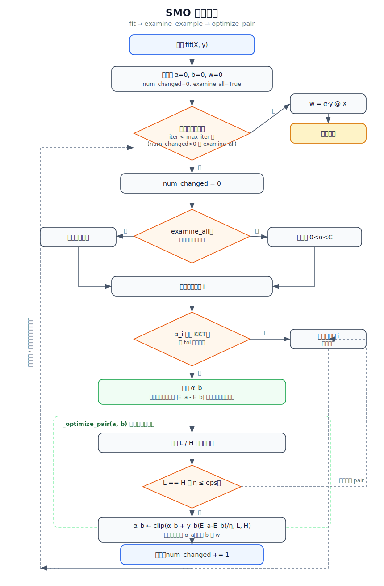

# SVM SMO 求解算法

本目录用于整理支持向量机（SVM）对偶问题的 SMO（Sequential Minimal Optimization）求解思路与线性核实现。

## 目录结构

```text
machine_learning/svm/
├── README.md      # 理论说明、约束推导和运行方式
├── smo_flow.svg   # SMO 求解流程图
└── smo_svm.py     # 线性核 SMO 求解器与最小演示数据
```

## 一、优化目标

软间隔 SVM 的对偶问题可以写成：

$$
\min_{\alpha}\frac{1}{2}\sum_i\sum_j\alpha_i\alpha_jy_iy_jK(x_i,x_j)-\sum_i\alpha_i
$$

约束为：

$$
\sum_i y_i\alpha_i=0,\qquad 0\le\alpha_i\le C
$$

其中：

- $\alpha_i$ 是每个样本对应的拉格朗日乘子。
- $C$ 控制软间隔惩罚强度。
- $K(x_i,x_j)$ 是核函数，本实现使用线性核 $K(x_i,x_j)=x_i^\top x_j$。

## 二、SMO 核心流程

SMO 每次只优化两个变量 $\alpha_a,\alpha_b$，原因是等式约束要求所有 $\alpha$ 与标签的加权和为 0。固定其他变量后，只要改变其中一个变量，另一个变量就能被唯一确定。

整体流程：

1. 外层扫描样本，选择违背 KKT 条件的 $\alpha_a$。
2. 内层优先选择使 $|E_a-E_b|$ 最大的 $\alpha_b$。
3. 根据二变量子问题计算 $\alpha_b$ 的无约束最优值。
4. 使用 $L/H$ 将 $\alpha_b$ 裁剪到盒约束范围。
5. 由等式约束反推 $\alpha_a$。
6. 根据新的两个变量更新偏置项 $b$。
7. 重复扫描，直到没有变量明显违背 KKT 或达到最大迭代次数。

### 求解流程图

下图对应 `smo_svm.py` 中 `fit`、`_examine_example`、`_optimize_pair` 三个核心函数的调用关系：



## 三、关键约束

### 1. 等式约束

固定其他变量后，两个待优化变量必须满足：

$$
y_a\alpha_a+y_b\alpha_b=y_a\alpha_a^{old}+y_b\alpha_b^{old}
$$

因此：

$$
\alpha_a^{new}=\alpha_a^{old}+y_ay_b(\alpha_b^{old}-\alpha_b^{new})
$$

这一步让二变量优化只需要显式求解 $\alpha_b$。

### 2. 盒约束 L/H

为了保证 $0\le\alpha_a,\alpha_b\le C$，需要先算出 $\alpha_b$ 的合法区间。

当 $y_a\neq y_b$：

$$
L=\max(0,\alpha_b^{old}-\alpha_a^{old}),\qquad
H=\min(C,C+\alpha_b^{old}-\alpha_a^{old})
$$

当 $y_a=y_b$：

$$
L=\max(0,\alpha_a^{old}+\alpha_b^{old}-C),\qquad
H=\min(C,\alpha_a^{old}+\alpha_b^{old})
$$

若 $L=H$，说明本轮没有可移动空间，直接跳过。

### 3. eta

线性核下二次项曲率为：

$$
\eta=K_{aa}+K_{bb}-2K_{ab}
$$

当 $\eta\le0$ 或过小时，二变量子问题不适合使用这个解析更新，本实现直接跳过本次 pair。

### 4. KKT 收敛条件

SVM 对偶问题的 KKT 条件可以概括为：

$$
\begin{cases}
\alpha_i=0 \Rightarrow y_if(x_i)\ge1\\
0<\alpha_i<C \Rightarrow y_if(x_i)=1\\
\alpha_i=C \Rightarrow y_if(x_i)\le1
\end{cases}
$$

代码中用 `tol` 作为容忍误差，避免浮点误差导致训练过程无法停止。

## 四、代码对应关系

`smo_svm.py` 中的主要方法：

- `fit(X, y)`：训练入口，完成全量样本与非边界样本的交替扫描。
- `_examine_example(a_idx)`：判断 $\alpha_a$ 是否违反 KKT，并选择候选 $\alpha_b$。
- `_optimize_pair(a_idx, b_idx)`：完成一次二变量 SMO 更新。
- `_bounds(...)`：计算 $L/H$。
- `_clip(...)`：裁剪 $\alpha_b$。
- `decision_function(X)`：输出 $f(x)$。
- `predict(X)`：输出 $-1/1$ 分类结果。

## 五、运行演示

在项目根目录执行：

```bash
python3 machine_learning/svm/smo_svm.py
```

输出会展示：

- 训练后的 `alpha`
- 偏置 `b`
- 线性权重 `w`
- 支持向量
- 训练集准确率
- 两个新样本的预测结果

## 六、一句话总结

SMO 的核心是：每次找出一个违反 KKT 的变量，再选另一个变量配对，在等式约束和盒约束共同限制下完成二变量解析更新，循环直到所有 $\alpha$ 基本满足 KKT。
